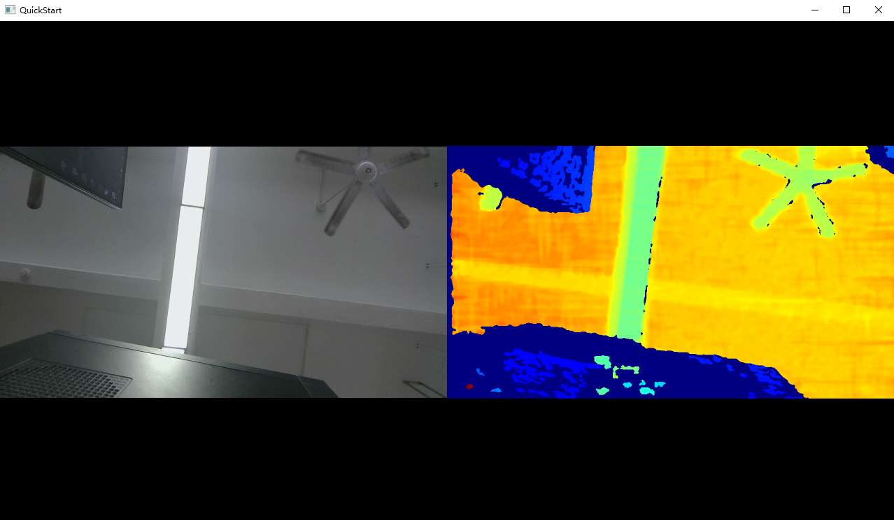

# Open Orbbec SDK

## 1. Introduction

This is the open source version of the Orbbec SDK. It is a cross-platform library for interfacing with the Orbbec RGB-D cameras. It provides C/C++ APIs and many other languages or systems [wrappers](wrappers/readme.md).

<div align=center>

</div>


*The relationship between the Orbbec SDK and the Orbbec SDK Open Source Version was explained in the [Orbbec SDK Version Comparison](TODO: add link)*

### 1.1 Supported Platforms

- Windows 10 or later: x86 and x64 architectures
- Linux x64: tested on Ubuntu 18.04 and 20.04
- Linux ARM32: tested on Raspberry Pi 3 and 4
- Linux ARM64: tested on NVIDIA Jetson Nano, TX2, and Xavier NX
- Android: coming soon
- macOS: coming soon

### 1.2 Supported Devices

| Device             | Latest Firmware Version | Notes |
| ------------------ | ----------------------- | ----- |
| Orbbec Gemini 335  | 1.2.20                  |       |
| Orbbec Gemini 335L | 1.2.20                  |       |

More devices support will be added in the near future. If you can not find your device in the table above currently, try the close version: [Orbbec SDK](https://github.com/orbbec/OrbbecSDK)

## 2. Download

The latest release of the SDK can be downloaded from the [releases page](https://github.com/orbbec/OpenOrbbecSDK/releases).

The Orbbec Viewer to connect Orbbec RGB-D cameras and experience the features can be downloaded from here: [Orbbec Viewer](TODO: add link)

## 3. Documentation

### 3.1 Quick Start

For a comprehensive guide on installing the SDK, setting up your development environment, and developing applications, please consult the [Tutorial](docs/tutorial/Installation_and_Development_Guide.md) section for detailed information.

For practical examples on utilizing the SDK, refer to the [Examples](examples/README.md) section for more insights.

To learn how to effectively use the Orbbec Viewer, please refer to the Orbbec Viewer User Guide. (TODO: Replace the placeholder with the actual link when available.)

### 3.2 API Reference
API Reference: [Orbbec_SDK_API_Reference.html](https://orbbec.github.io/OrbbecSDK/doc/api/English/index.html)

OrbbecSDK C++ API user guide：[Orbbec_SDK_C++_API_user_guide-v1.0.pdf](https://orbbec.github.io/OrbbecSDK/doc/tutorial/English/OrbbecSDK_C++_API_user_guide-v1.0.pdf)

### 3.3 Building from Source
For building the SDK from source, please refer to the [build guide](docs/build/Building_Open_Orbbec_SDK.md) for more information.

### 3.4 Developer Guide
For the developers who want to contribute to the SDK, please refer to the [developer guide](docs/developer/Contributing_to_Open_Orbbec_SDK.md) for more information.

### 3.5 FAQ
Most frequently asked questions can be found in the [FAQ](docs/FAQ.md) file.

More asked and answered questions can be found in the [issues](https://github.com/orbbec/OpenOrbbecSDK/issues) channel. Use key words for searching may help you find the answer you are looking for.

## 4. Gallery

### 4.1 Running the QuickStart Example
Code snippet of the QuickStart example:
```c++
// Create a pipeline.
ob::Pipeline pipe;

// Start the pipeline with default config.
pipe.start();

// Create a window for showing the frames, and set the size of the window.
ob_smpl::CVWindow win("QuickStart", 1280, 720, ob_smpl::ARRANGE_ONE_ROW);

while(win.run()) {
    // Wait for frameSet from the pipeline, the default timeout is 1000ms.
    auto frameSet = pipe.waitForFrameset();

    // Push the frames to the window for showing.
    win.pushFramesToView(frameSet);
}

// Stop the Pipeline, no frame data will be generated
pipe.stop();
```



### 4.2 Using Orbbec Viewer to experience the features


## 5. Contributing
Currently, we are not accepting external contributions to expand the functionality of the SDK. But we will be happy to review any pull requests or suggestions you may have.
Please contact us at [issues](https://github.com/orbbec/OpenOrbbecSDK/issues) channel if you have any questions or concerns.

## 6. License
This project is licensed under the MIT License with some other licenses for third-party libraries and extensions - see the [LICENSE](LICENSE.txt) file for details.

## 7. Links
* [Orbbec SDK Open Source Version Repo](https://github.com/orbbec/OpenOrbbecSDK)
* [Orbbec SDK Close Source Version Repo](https://github.com/orbbec/OrbbecSDK)
* [Orbbec Main Page](https://www.orbbec.com/)
* [Orbbec 3D Club](https://3dclub.orbbec3d.com)