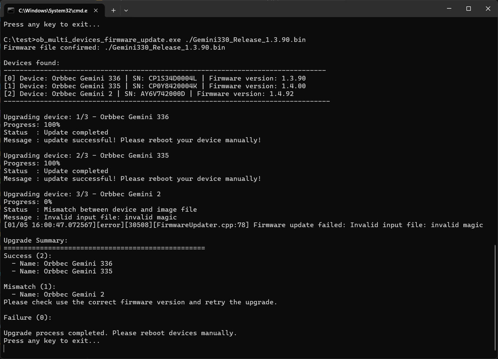

# C++ Sample：2.multi_devices_firmware_update

## Overview

If you want to upgrade multiple Orbbec cameras connected to your system, this sample might be helpful for you. For detailed information about firmware upgrades, please refer to the [2.device.firmware_update](../2.device.firmware_update/README.md).

> Note: This sample are not suiltable for Femto Mega, Femto Mega i, and Femto Bolt devices.
> For these devices, please refer to the this repo:[https://github.com/orbbec/OrbbecFirmware](https://github.com/orbbec/OrbbecFirmware)

### Knowledge

Context is the environment context, the first object created during initialization, which can be used to perform some settings, including but not limited to device status change callbacks, log level settings, etc. Context can access multiple Devices.

Device is the device object, which can be used to obtain the device information, such as the model, serial number, and various sensors.One actual hardware device corresponds to one Device object.

## code overview

1. Initialize the SDK Context: This is necessary to access the connected devices.

    ```c++
        std::shared_ptr<ob::Context> context = std::make_shared<ob::Context>();
    ```
2. List Connected Devices.

    ```c++
        std::shared_ptr<ob::DeviceList> deviceList = context->queryDeviceList();
        for(uint32_t i = 0; i < deviceList->getCount(); ++i) {
            devices.push_back(deviceList->getDevice(i));
        }
    ```
3. Update each device.

    You don't need to worry about issues caused by using incorrect firmware during the upgrade process. The SDK performs internal verification of the firmware to ensure its compatibility and validity.

    ```c++
        for(uint32_t i = 0; i < totalDevices.size(); ++i) {
            try {
                std::cout << "\nUpgrading device: " << i + 1 << "/" << totalDevices.size() 
                            << " - " << totalDevices[i]->getDeviceInfo()->getName() << std::endl;

                totalDevices[i]->updateFirmware(firmwarePath.c_str(), firmwareUpdateCallback, false);
            }
            catch(ob::Error &e) {
                std::cerr << "function:" << e.getFunction() << "\nargs:" << e.getArgs() << "\nmessage:" << e.what() << "\ntype:" << e.getExceptionType()
                            << std::endl;
            }
        }
    ```

4. Retrieve Status from the Callback

    ```c++
        void firmwareUpdateCallback(OBFwUpdateState state, const char *message, uint8_t percent) {
            if(firstCall) {
                firstCall = !firstCall;
            }
            else {
                std::cout << "\033[3F";  // Move cursor up 3 lines
            }

            std::cout << "\033[K";  // Clear the current line
            std::cout << "Progress: " << static_cast<uint32_t>(percent) << "%" << std::endl;

            std::cout << "\033[K";
            std::cout << "Status  : ";
            switch(state) {
            case STAT_VERIFY_SUCCESS:
                std::cout << "Image file verification success" << std::endl;
                break;
            case STAT_FILE_TRANSFER:
                std::cout << "File transfer in progress" << std::endl;
                break;
            case STAT_DONE:
                std::cout << "Update completed" << std::endl;
                break;
            case STAT_IN_PROGRESS:
                std::cout << "Upgrade in progress" << std::endl;
                break;
            case STAT_START:
                std::cout << "Starting the upgrade" << std::endl;
                break;
            case STAT_VERIFY_IMAGE:
                std::cout << "Verifying image file" << std::endl;
                break;
            case ERR_MISMATCH:
                std::cout << "Mismatch between device and image file" << std::endl;
                break;
            default:
                std::cout << "Unknown status or error" << std::endl;
                break;
            }

            std::cout << "\033[K";
            std::cout << "Message : " << message << std::endl << std::flush;

            if(state == STAT_DONE) {
                finalSuccess = true;
                finalFailure = false;
            }
            else if(state == ERR_MISMATCH) {
                // If the device's firmware version does not match the image file, the callback status will be ERR_MISMATCH.
                finalMismatch = true;
            }
            else if(state < 0) {
                // While state < 0, it means an error occurred.
                finalFailure = true;
            }
        }
    ```

### Attention

1. After the firmware update completes, you need to restart the device manually to apply the new firmware. Alternatively, you can use the `reboot()` function to restart the device programmatically.

    ```c++
        device->reboot();
    ```

2. Don't plug out the device during the firmware update process.

3. For linux users, it is recommended to use the `LibUVC` as the backend as the `V4L2` backend may cause some issues on some systems. Switch backend before create device like this:

    ```c++
        context->setUvcBackendType(OB_UVC_BACKEND_TYPE_LIBUVC);
    ```

## Run Sample

By providing the firmware file path via the command line, the program will automatically upgrade the devices that match the firmware.

### Result


