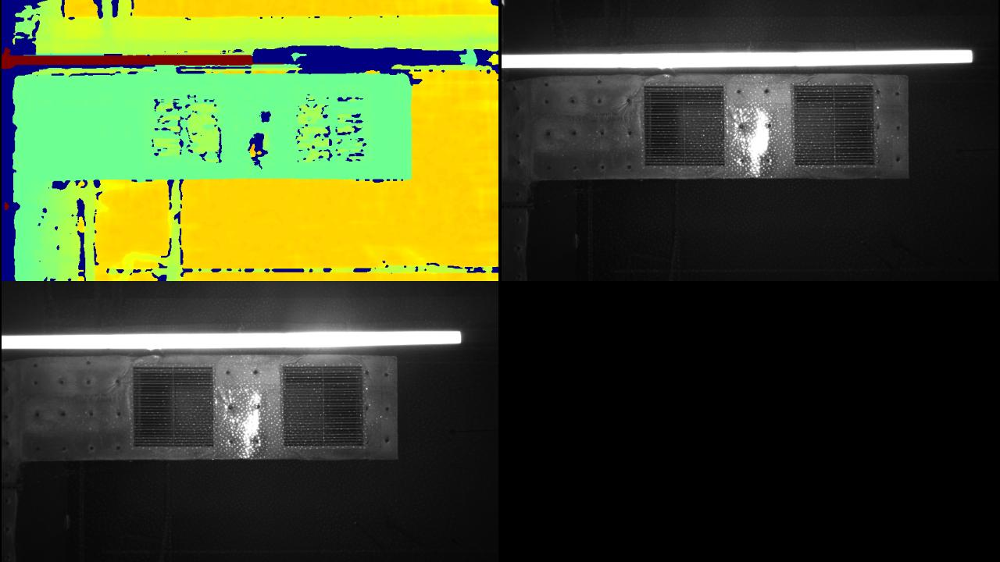
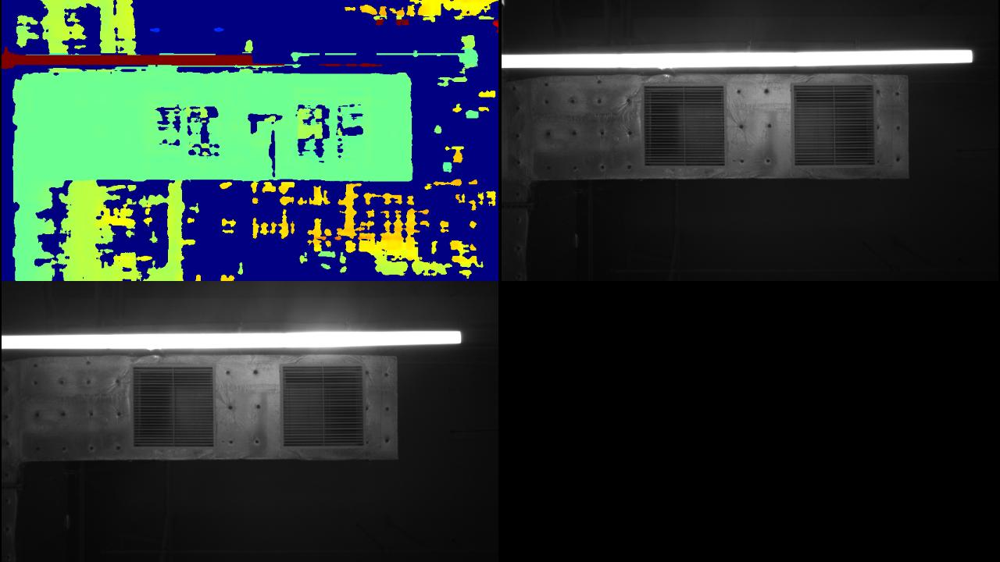

# C++ Sample: 3.advanced.interleave

## Overview

In this sample, user can enable or disable the function of laser frame interleave and SequenceId filter.

### Knowledge

Pipeline is a pipeline for processing data streams, providing multi-channel stream configuration, switching, frame aggregation, and frame synchronization functions

Frameset is a combination of different types of Frames

### Attentions

> This Sample only supports Gemini330 series devices.

## Code overview

### 1. Check if the device supports frame interleave

```c++
    if(!device->isFrameInterleaveSupported()) {
        std::cerr << "Current default device does not support frame interleave" << std::endl;
        std::cout << "Press any key to exit...";
        ob_smpl::waitForKeyPressed();
        return -1;
    }
```

### 2. Enable depth and IR stream

Enable depth camera, left IR camera and right IR camera with default profiles

```c++
    std::shared_ptr<ob::Config> config = std::make_shared<ob::Config>();
    // enable depth stream with default profile
    config->enableVideoStream(OB_STREAM_DEPTH);
    config->enableVideoStream(OB_STREAM_IR_LEFT);
    config->enableVideoStream(OB_STREAM_IR_RIGHT);
    config->setFrameAggregateOutputMode(OB_FRAME_AGGREGATE_OUTPUT_ALL_TYPE_FRAME_REQUIRE);
```

### 3. Create SequenceId filter

Create SequenceId post processor to filter frames.

```c++
    auto postDepthFilter         = ob::FilterFactory::createFilter("SequenceIdFilter");
    auto postLeftInfraredFilter  = ob::FilterFactory::createFilter("SequenceIdFilter");
    auto postRightInfraredFilter = ob::FilterFactory::createFilter("SequenceIdFilter");
```

### 5. Enable laser frame laser interleave

```c++
    // load frame interleave mode as 'Laser On-Off'
    device->loadFrameInterleave("Laser On-Off");
    // enable frame interleave
    device->setBoolProperty(OB_PROP_FRAME_INTERLEAVE_ENABLE_BOOL, true);
    
    // The default parameters were loaded when loadFrameInterleave is called
    // You can also modify these parameters yourself
    //
    // 1. frame interleave parameters for index 1(index starts from 0):
    // device->setIntProperty(OB_PROP_FRAME_INTERLEAVE_CONFIG_INDEX_INT, 1);
    // device->setIntProperty(OB_PROP_LASER_CONTROL_INT, 0);  // first: set laser control to 0 to turn off laser
    // device->setIntProperty(OB_PROP_DEPTH_EXPOSURE_INT, 3000);
    // device->setIntProperty(OB_PROP_DEPTH_GAIN_INT, 16);
    // device->setIntProperty(OB_PROP_IR_BRIGHTNESS_INT, 60);
    // device->setIntProperty(OB_PROP_IR_AE_MAX_EXPOSURE_INT, 17000);

    // 2. frame interleave parameters for index 0(index starts from 0):
    // device->setIntProperty(OB_PROP_FRAME_INTERLEAVE_CONFIG_INDEX_INT, 0);
    // device->setIntProperty(OB_PROP_LASER_CONTROL_INT, 1);  // second: set laser control to 1 to turn on laser
    // device->setIntProperty(OB_PROP_DEPTH_EXPOSURE_INT, 3000);
    // device->setIntProperty(OB_PROP_DEPTH_GAIN_INT, 16);
    // device->setIntProperty(OB_PROP_IR_BRIGHTNESS_INT, 60);
    // device->setIntProperty(OB_PROP_IR_AE_MAX_EXPOSURE_INT, 30000);
```

### 7. Stop the pipeline and close frame interleave

```c++
    // Stop the Pipeline, no frame data will be generated
    pipe.stop();

// close hdr merge
    device->setBoolProperty(OB_PROP_FRAME_INTERLEAVE_ENABLE_BOOL, false);
```

## Run Sample

### Key introduction

Press the 'Esc' key in the window to exit the program.
Press the '?' key in the window to show key map.

### Result

After enabling laser frame interleave and SequenceId filter, 
the user can set the sequence id of depth to 0 and the sequence id of IR to 1, 
which will enhance the depth image quality and get the pure IR image.

1. laser interleave when sequence id is 0


2. laser interleave when sequence id is 1

