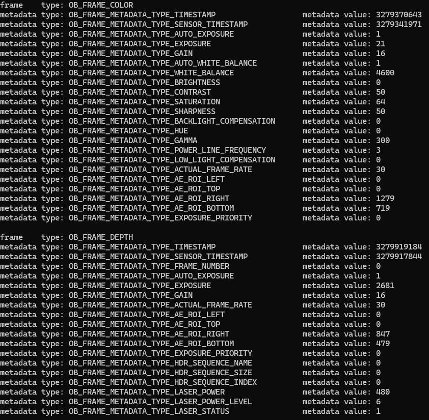

# C++ Sample: 4.misc.metadata

## Overview

Use the SDK interface to get the frameSet, then get the frame from frameSet, print the value of the frame metadata and exit the program using the ESC_KEY key.

### Knowledge

Pipeline is a pipeline for processing data streams, providing multi-channel stream configuration, switching, frame aggregation, and frame synchronization functions.

Frameset is a combination of different types of Frames.

Metadata is used to describe the various properties and states of a frame.

## Code overview

1. Create an ob::Pipeline object, and start the pipeline.

    ```cpp
    // Create a pipeline.
    ob::Pipeline pipe;

    // Start the pipeline with default config.
    // Modify the default configuration by the configuration file: "OrbbecSDKConfig.xml"
    pipe.start();
    ```

2. Get frameSet from pipeline.

    ```cpp
    // Wait for frameSet from the pipeline, the default timeout is 1000ms.
    auto frameSet   = pipe.waitForFrameset();
    ```

3. Get frame from frameSet.

    ```cpp
    auto frameCount = frameSet->getCount();
    for(uint32_t i = 0; i < frameCount; i++) {
        // Get the frame from frameSet
        auto frame = frameSet->getFrame(i);
    }
   ```

4. Check if the frame object contains metadata, then retrieve it.

    ```cpp
    // Get the metadata of the frame
    for(uint32_t j = 0; j < static_cast<uint32_t>(metadataCount); j++) {
        // If the frame has the metadata, get the metadata value
        if(frame->hasMetadata(static_cast<OBFrameMetadataType>(j))) {
            std::cout << "metadata type: " << std::left << std::setw(50) << metadataTypeMap[j]
                      << " metadata value: " << frame->getMetadataValue(static_cast<OBFrameMetadataType>(j)) << std::endl;
        }
    }
    ```

6. Stop pipeline

    ```cpp
    // Stop the Pipeline, no frame data will be generated
    pipe.stop();
    ```

## Run Sample

Press the Esc key in the window to exit the program.

### Result


