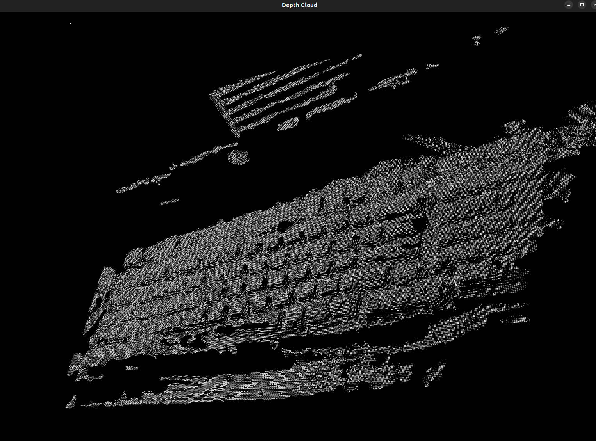

# C++ Sample: 5.wrapper.pcl

## Overview

Use OrbbecSDK to acquire point cloud data and convert the acquired point cloud data to PCL library point cloud data


## Code overview

1. Create an ob::Pipeline object, and get frameSet from pipeline..

    ```cpp
    // create pipeline to manage the streams
    auto pipeline = std::make_shared<ob::Pipeline>();

    // Start pipeline with config
    pipeline->start(config);

    // Wait for frames to be available
    auto frameset    = pipeline->waitForFrames();
    auto depth_frame = frameset->getFrame(OB_FRAME_DEPTH);
    ```

2. Create a PointCloud object and convert the depth frame to point cloud data.

    ```cpp
    // Create a point cloud Filter, which will be used to generate pointcloud frame from depth and color frames.
    auto pointCloudFilter = std::make_shared<ob::PointCloudFilter>();

    // Set the format of the point cloud to be generated.
    pointCloudFilter->setCreatePointFormat(OB_FORMAT_POINT);
    auto result = pointCloudFilter->process(depth_frame);
   ```

3. Convert the point cloud data to PCL library point cloud data.

    ```cpp
    pcl::PointCloud<pcl::PointXYZ>::Ptr frameToPCL(std::shared_ptr<ob::Frame> frame) {
        pcl::PointCloud<pcl::PointXYZ>::Ptr cloud(new pcl::PointCloud<pcl::PointXYZ>);

        uint32_t pointsSize = frame->dataSize() / sizeof(OBPoint);
        OBPoint *point      = (OBPoint *)frame->data();

        cloud->points.resize(pointsSize);

        for(uint32_t i = 0; i < pointsSize; i++) {
            cloud->points[i].x = point->x;
            cloud->points[i].y = point->y;
            cloud->points[i].z = point->z;

            point++;
        }

        return cloud;
    }
    ```

4. Render the point cloud data using PCL library.

    ```cpp
    pcl::visualization::PCLVisualizer vis2("Depth Cloud");
    vis2.addPointCloud(pclPoint);
    vis2.spin();
    ```

## Run Sample

Press the q or Q key in the window to exit the program.

### Result


